# Styled Barcode

> Linear and 2D barcodes for Mendix: 71 symbologies on bwip-js, GS1 element strings and Digital Link
> builders, check digits, human readable text, colours and rotation, multi-format export, bulk list
> mode with ZIP and label-sheet PDF, save to an attribute and per-render validation.

A Mendix pluggable widget built on [bwip-js](https://github.com/metafloor/bwip-js), the JavaScript port
of Terry Burton's BWIPP, which encodes every symbology this widget offers. Nothing is fetched at
runtime: the barcode is drawn as SVG in the browser.

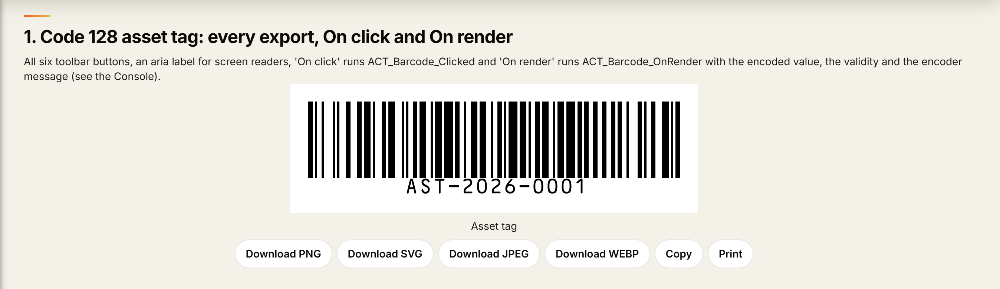

- Mendix 11.0 or newer, web only
- Category: Display
- License: Apache-2.0 (bwip-js is MIT)

## Installation

Download `com.mxtechies.widget.web.StyledBarcode.mpk` from the
[latest release](https://github.com/bharathidas/StyledBarcode/releases) (or the Mendix Marketplace)
and drop it into the `widgets` folder of your app, then press F4 in Studio Pro.

## Usage

1. Drop **Styled Barcode** on a page.
2. Pick a **Symbology** (Code 128 by default) and set **Value** to an expression such as
   `'ASSET-00417'` or `$currentObject/Code`.
3. Adjust the **Design** tab: scale, bar height, colours, human readable text, rotation, border.
4. Switch on the export buttons you want on the **Toolbar** tab.

### Symbologies

71 symbologies, plus a **Custom** option that takes any BWIPP encoder name for anything not in the list.

| Family | Symbologies |
| --- | --- |
| Retail | EAN-13 (with add-on), EAN-8, UPC-A, UPC-E, ISBN, ISSN, ISMN, EAN-14 / GTIN-14, SSCC-18 |
| General linear | Code 128, GS1-128 (EAN-128), Code 39, Code 39 Extended, Code 93, Code 93 Extended, Interleaved 2 of 5, ITF-14, Code 25 Industrial, Codabar, Code 11, MSI Plessey, Plessey UK, Telepen |
| Pharmaceutical | Pharmacode, Two-track Pharmacode, Italian Pharmacode (Code 32), PZN |
| GS1 DataBar | Omnidirectional, Stacked, Stacked Omnidirectional, Limited, Truncated, Expanded, Expanded Stacked |
| Matrix | Data Matrix, Data Matrix Rectangular, GS1 Data Matrix, GS1 Digital Link Data Matrix, QR Code, Micro QR, Rectangular Micro QR (rMQR), GS1 QR Code, GS1 Digital Link QR Code, Swiss QR Code, Aztec, Compact Aztec, MaxiCode, DotCode, Han Xin, Code One, Ultracode |
| Stacked | PDF417, Compact PDF417, MicroPDF417, Codablock F, Code 16K, Code 49 |
| Postal | USPS POSTNET, USPS PLANET, USPS Intelligent Mail, Royal Mail 4 State, Royal Mail Mailmark, Australia Post 4 State, Dutch KIX, Japan Post 4 State, Deutsche Post Identcode, Deutsche Post Leitcode |
| Healthcare | HIBC Code 128, HIBC Code 39, HIBC Data Matrix, HIBC PDF417 |

### GS1 element strings and Digital Link

Set **Payload** to *GS1 element string* and fill the fields instead of hand-writing AI syntax. The widget
assembles the element string, puts variable-length AIs last and adds FNC1 separators where they are
needed:

| Field | AI |
| --- | --- |
| GTIN | 01 |
| SSCC | 00 |
| Content GTIN | 02 |
| Count | 37 |
| Batch or lot | 10 |
| Serial number | 21 |
| Production date | 11 |
| Best before | 15 |
| Expiry date | 17 |
| Net weight kg | 310n |
| Price | 392n |

**GTIN check digit** can be left as entered or calculated and appended, so a 13-digit GTIN or a 17-digit SSCC
becomes a valid 14 or 18 digit code without a microflow. **More element strings** takes any additional
`(AI)value` pairs verbatim.

Set **Payload** to *GS1 Digital Link URL* and the same fields become a resolver URL
(`https://id.gs1.org/01/09521234543213/10/LOT1?17=261231`), with **Digital Link domain** for your own resolver. Pair
it with the *GS1 Digital Link QR Code* or *GS1 Digital Link Data Matrix* symbology.

### Human readable text

**Show text** draws the interpretation under the bars. Font (OCR-B or OCR-A), size, alignment,
position above or below, vertical offset and letter spacing are all configurable, and
**Custom text** replaces the encoded value with your own string when the printed text has to differ
from the data.

### Bulk (list) mode

Set **Render as** to *List of barcodes*, pick a **Data source** and a **Value per object** expression.
One barcode is rendered per object, all sharing the same design, with an optional **Symbology per
object** (so one list can mix Code 128 and Data Matrix), **Label per object**, **File name per object**
and **Extra options per object**. Long lists render each code only when it scrolls into view. The list
toolbar offers **Download all (ZIP)**, **Print label sheet** and **Download label sheet (PDF)**; the
sheet layout (columns, label size in mm, gap, captions, title) is configurable and prints on A4.

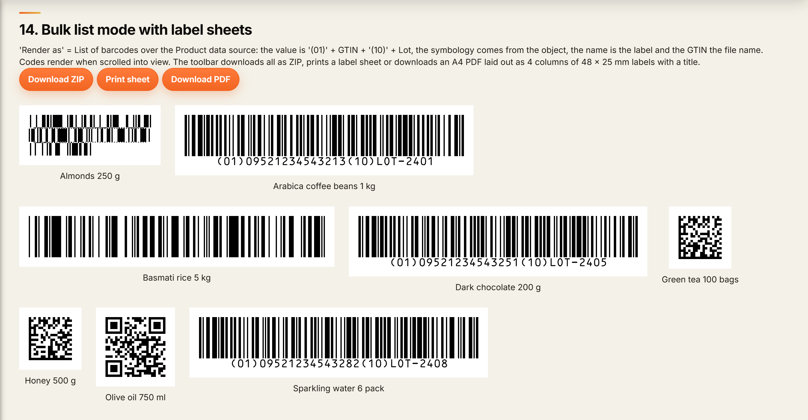

### Save the image and the value to Mendix

Bind **Base64 attribute** (a String attribute, ideally unlimited length). After every render, and after
the configurable **Save delay**, the widget writes the image (PNG, SVG, JPEG or WEBP) as base64 into it
and runs **On image saved**. **Encoded value attribute** stores the exact string that was encoded, which
matters for GS1 element strings and Digital Links that the widget assembled for you. Use a microflow with
Community Commons `Base64DecodeToFile` to turn the image into a `System.Image` for documents, labels and
PDFs; pluggable widgets cannot write file documents directly, which is why the base64 route is used.

### Export

Toolbar buttons download the barcode as PNG, SVG, JPEG or WEBP, copy it to the clipboard as PNG, or print
it on its own. Printing uses a hidden iframe, so the page around it is untouched.

### Validation and limits

bwip-js rejects data a symbology cannot carry: letters in an EAN-13, a bad check digit, an odd digit count
in an ITF. Instead of a broken image the widget shows **Invalid message** with the encoder's reason and
writes `false` to the optional **Valid attribute**, so a form can block Save before a bad label is
printed. **On render** runs after every render with the encoded value and the validity as variables.
Values longer than **Maximum length** show **Too long message** instead of attempting a render.

### Encoding options

**Add check digit** and **Show check digit in text** control the symbologies that have an optional check
character. **Quiet zone marks** print the `<` and `>` guards that show the quiet zone survived trimming.
**Parse escapes** turns `^065` into `A` for control characters, and **Parse function codes** enables
`^FNC1`. **Ink spread compensation** counters bleed on thermal printers. **Extra BWIPP options** passes
any encoder option straight through in BWIPP syntax for the ones the widget does not expose as
properties.

## Properties

| Tab | Group | Properties |
| --- | --- | --- |
| General | Data | Render as, Symbology, Custom symbology, Payload, Value, Caption |
| General | GS1 fields | GTIN (01), GTIN check digit, SSCC (00), Content GTIN (02), Count (37), Batch or lot (10), Serial number (21), Production date (11), Best before (15), Expiry date (17), Net weight kg (310n), Price (392n), More element strings, Digital Link domain |
| General | List | Data source, Value / Symbology / Extra options / Label / File name per object, Gap, Render when visible, Empty message |
| Design | Size | Scale, Bar height (mm), Minimum width (mm), Size mode (natural / fit container), Rotation, Padding |
| Design | Colours | Bar colour, Transparent background, Background colour, Text colour |
| Design | Human readable text | Show text, Custom text, Font (OCR-B / OCR-A), Font size, Horizontal alignment, Vertical position, Vertical offset, Letter spacing |
| Design | Border | Show border, Border width, Border colour |
| Encoding | Options | Add check digit, Show check digit in text, Quiet zone marks, Parse escapes, Parse function codes, Ink spread compensation, Extra BWIPP options, Maximum length |
| Encoding | Validation | Invalid message, Too long message, Valid attribute, Encoded value attribute |
| Toolbar | Buttons / Labels / Label sheet | Download PNG / SVG / JPEG / WEBP, Copy, Print, Save now, Download all (ZIP), Print label sheet, Download PDF, File name, Button style, Position, labels, sheet layout |
| Save to Mendix | Image attribute | Base64 attribute, Image format, Include data URI prefix, Save delay, On image saved |
| Events | Events | On click, On render |
| Accessibility | Accessibility | Aria label |

## Enterprise notes

- **Security**: nothing leaves the browser; no CDN, no telemetry. The barcode is SVG path geometry, so
  the encoded value never becomes markup.
- **Performance**: rendering is synchronous SVG; base64 export runs asynchronously and is cancelled when
  the props change; saves are debounced; lists render lazily.
- **Accessibility**: the barcode has `role="img"` with a translatable aria label, buttons are real
  buttons, notices use live regions, keyboard activation works when On click is set.
- **Localisation**: every label and message is a text template with translations.
- **Robustness**: encoder errors are shown in place instead of breaking the page; the widget never throws
  into the Mendix client.
- **Print quality**: bar height and minimum width are in millimetres and **Scale** multiplies the module
  size, so a scale of 3 or more is recommended for codes that will be printed and scanned; quiet zones
  follow each symbology's own rules through BWIPP.

## Styling

Root classes: `.mxt-bc` (single) and `.mxt-bc-list` (list). Inside: `.mxt-bc__stage`, `.mxt-bc__code`,
`.mxt-bc__svg`, `.mxt-bc__caption`, `.mxt-bc__notice`, `.mxt-bc__toolbar`, `.mxt-bc-list__toolbar`,
`.mxt-bc-list__empty`. State classes: `.mxt-bc--invalid`, `.mxt-bc--clickable`, `.mxt-bc--fit`,
`.mxt-bc-list--busy`, `.mxt-bc__notice--error`. Toolbars are hidden when the page is printed.

## Development

```bash
npm install
npm run build     # builds and copies the .mpk into ../../widgets
npm run lint
npm run release   # minified .mpk in dist/<version>
```

## License

Apache-2.0, © MX Techies 2026.

## Screenshots

The widget in Studio Pro. Structure mode shows where it sits in the page and the GS1 fields of the
selected code; Design mode renders the barcode at design time.

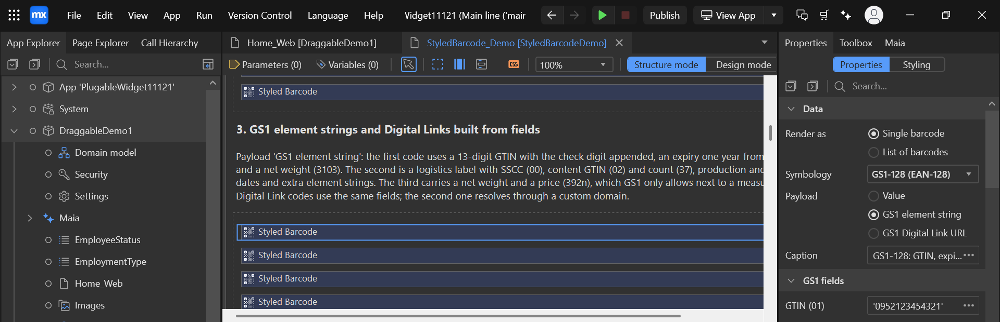

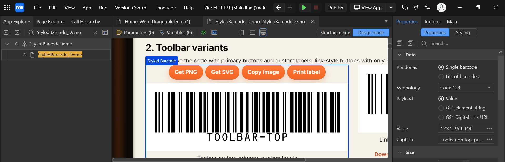

The rest are taken from the demo page in the example app.

| | |
| --- | --- |
| 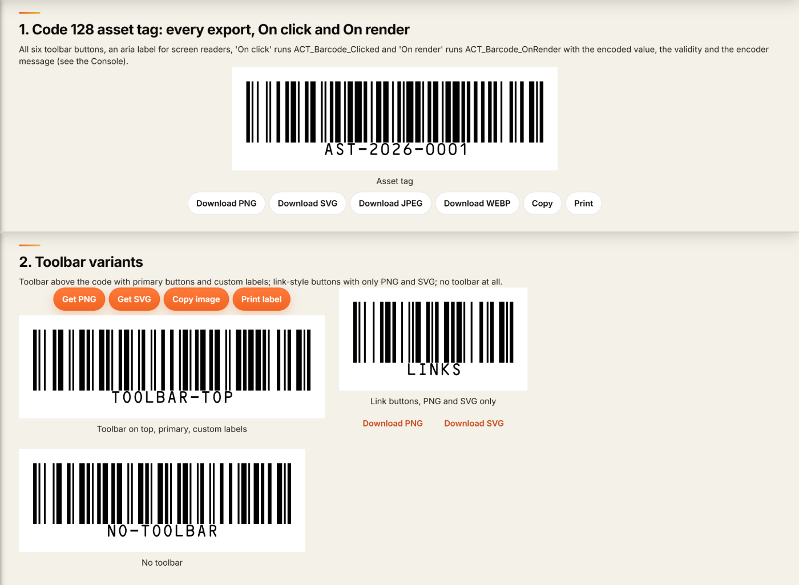 | 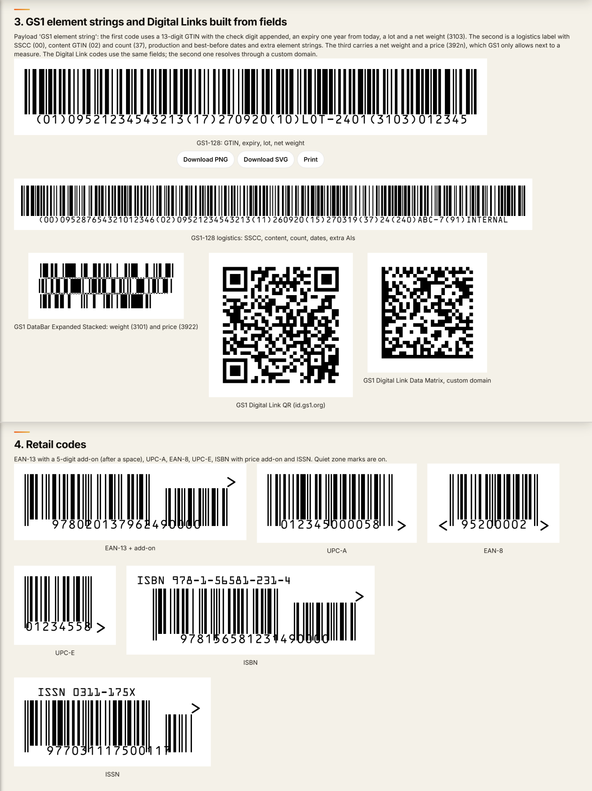 |
| 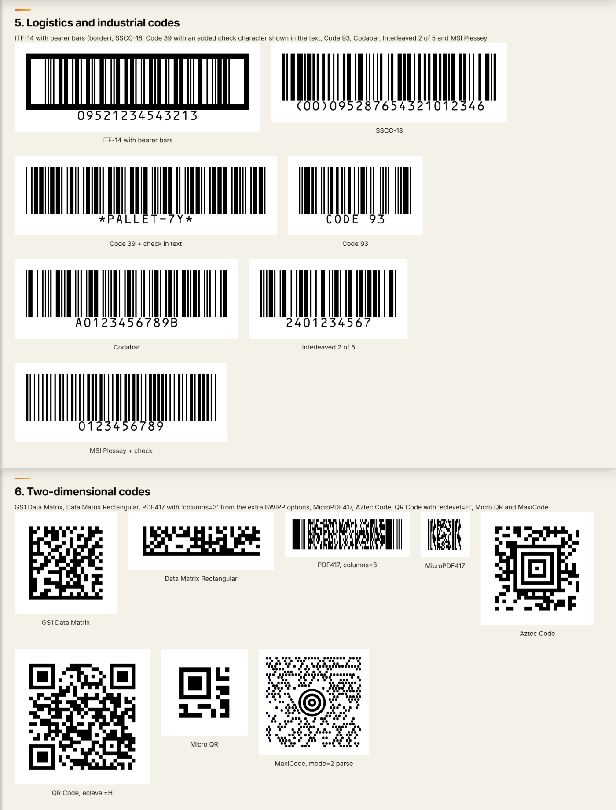 | 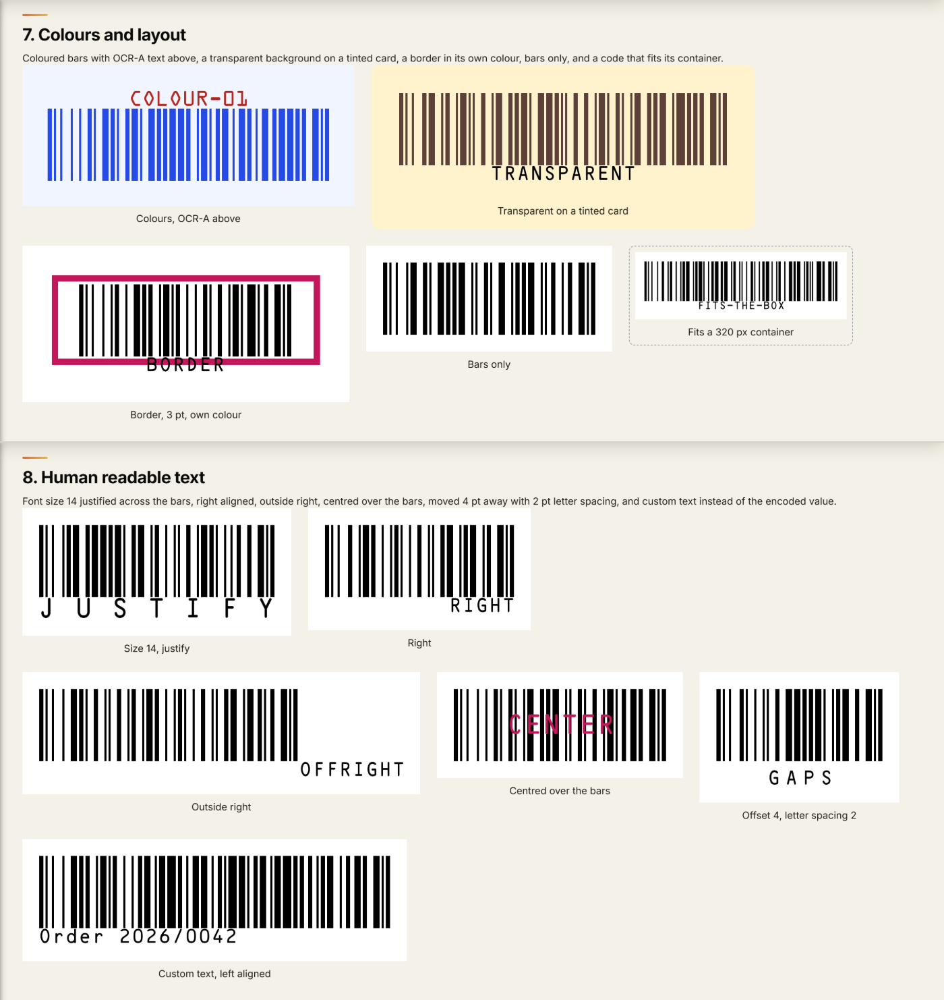 |
|  | 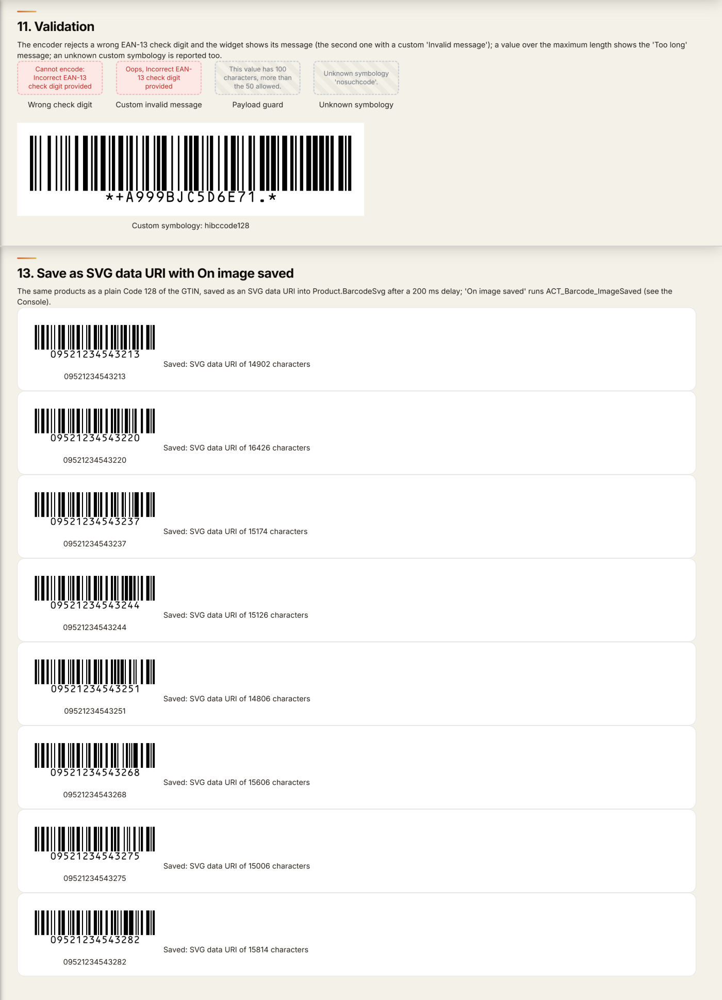 |
| 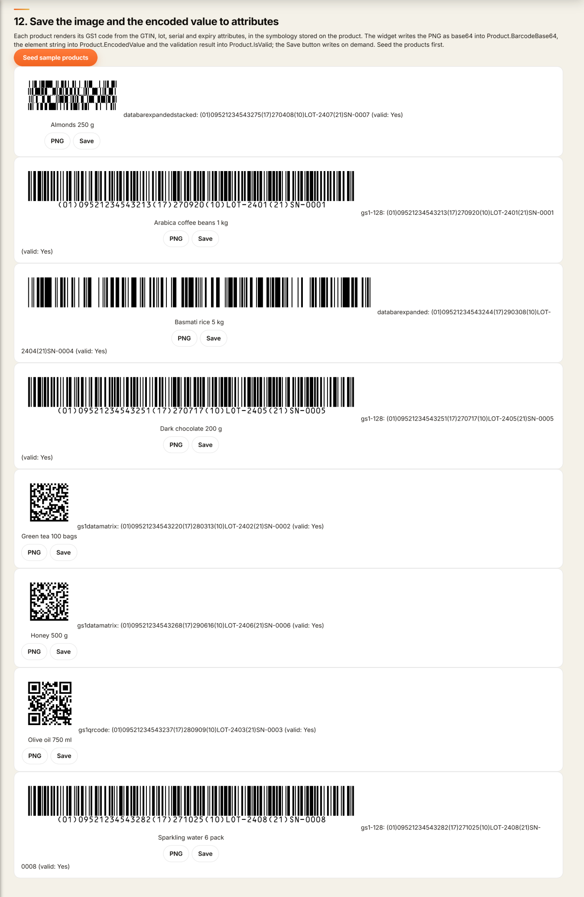 | 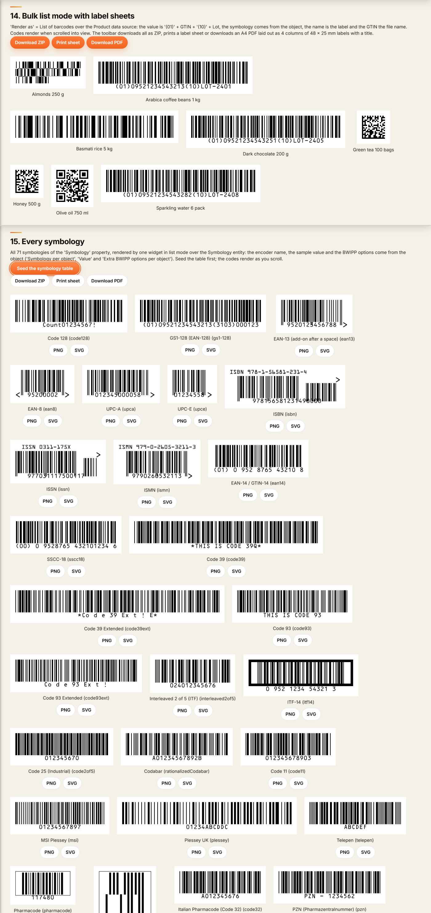 |

Also in the set: [the widget in Studio Pro, Structure and Design mode](docs/screenshots/screenshot-9.png) and
[a reference of all 98 properties](docs/screenshots/screenshot-10.png), generated from the widget XML.
